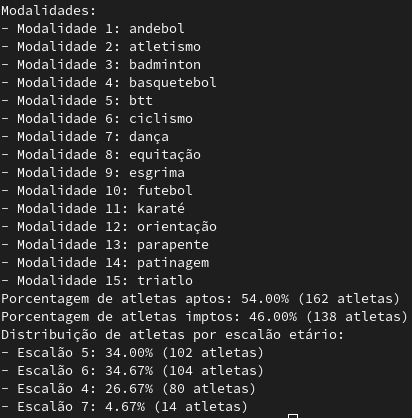

# PL2024 - TPC1

### Autor

**Nome:** Simão Antunes

**ID:** A100597

### Descrição
O objetivo deste TPC é ler um determinado dataset, processá-lo e obter uma lisa de modalidades ordenada alfabeticamente, a percentagem de atletas aptos e inaptos e a distribuição de atletas por escalão etário (intervalo de 5 anos).

### Como executar
`python3 emd.py < emd.csv`

### Resultados obtidos
