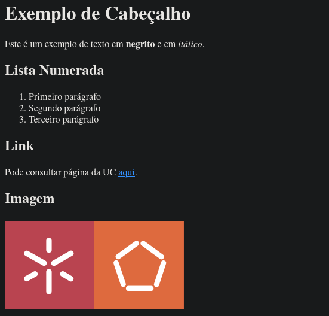

# PL2024

## Autor

**Nome:** Simão Antunes

**ID:** A100597

## Descrição
O objetivo deste TPC criar um pequeno conversor de MarkDown para HTML em Python para os elementos descritos na "Basic Syntax", nomeadamente cabeçalhos, negrito, itálico, lista numerada, link e imagem.

## Como executar
`python3 mdtohmtl.py < input.md`

## Resultados obtidos

