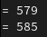

# PL2024

## Autor

**Nome:** Simão Antunes

**ID:** A100597

## Descrição
O objetivo deste TPC construir um pequeno somador escrito em python que dado um texto soma todas as ocorrências de inteiros. Sempre que encontrar a string “Off” em qualquer combinação de maiúsculas e minúsculas, esse comportamento é desligado e caso encontrar a string “On” em qualquer combinação de maiúsculas e minúsculas, esse comportamento é novamente ligado. Quando encontrar o caráter “=”, imprime o resultado da soma no dado momento.

## Como executar
`python3 somadoronoff.py < [input]`

## Resultados obtidos
**Input:** 
Este texto contém várias sequências de dígitos para testar o somador. 
Por exemplo os número 123 e 456 devem ser somados '='.
A partir de agora o somador está desligado, oFf.
Portanto estes número não vão ser somados 24, 37, 98.
Vamos ligar outra vez, On, e somar o 1, 2, 3...  
No final o resultado é '='. 
**Ouput:** 

