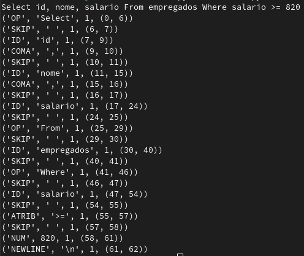

# PL2024

## Autor

**Nome:** Simão Antunes

**ID:** A100597

## Descrição
O objetivo deste TPC é construir um pequeno analisador léxico para uma linguagem de query, capaz de identificar as diferentes operações (Ex: Select, From, Where...), identificadores, atribuições e números.

## Como executar
`python3 analex.py`

## Resultados obtidos
