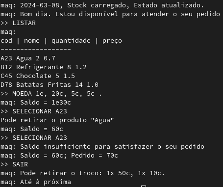

# PL2024

## Autor

**Nome:** Simão Antunes

**ID:** A100597

## Descrição
Este TPC consiste em construir um programa que simule uma máquina de vending. Esta deve ser capaz de carregar um stock de produtos no arranque do programa e é atualizado quando o programa termina. O stock segue o seguinte formato: uma lista de triplos, nome do produto, quantidade e preço. A máquina deve ser capaz de responder aos seguintes pedidos: 
- LISTAR
- MOEDA [moeda1, moeda2, ...].
- SELECIONAR [id do produto]
- SAIR

As moedas devem seguir o formato 2e, 1e, 50c, 20c, 10c, 5c, 2c e 1c e o troco deve ser devolvido em moedas.

## Como executar
`python3 maquinaVending.py`

## Resultados obtidos

