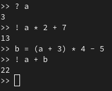

# PL2024

## Autor

**Nome:** Simão Antunes

**ID:** A100597

## Descrição
Para este TPC é necessário implementar um simples interpretador top-down para uma linguagem de expressões simples através do desenvolvimento de uma gramática independente de contexto LL(1), capaz de interpretar as seguintes linhas ('?' lê um valor do terminal para a variável e '!' imprime o resultado):
- ? a
- ! a * 2 + 7
- b = (a + 3) * 4 - 5
- ! a + b

## Como executar
`python3 anasin.py`

## Resultados obtidos

